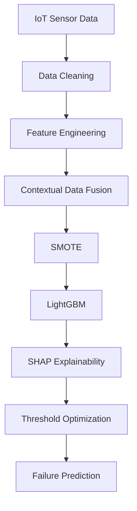
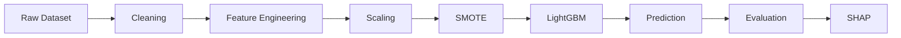

🚀 Infotact Technical Internship Program – Advanced Data Science & Machine Learning
📌 Project : Contextual Predictive Maintenance (IoT Edge AI)
📖 Project Overview

This project was developed as part of the Infotact Technical Internship Program – Advanced Data Science & Machine Learning (2026). The primary objective is to build an intelligent Contextual Predictive Maintenance System capable of predicting industrial equipment failures before they occur by combining IoT sensor telemetry with external contextual information.

Unlike traditional predictive maintenance models that rely only on internal machine sensors, this solution integrates environmental and operational context such as ambient temperature and machine load conditions to improve prediction accuracy and real-world reliability.

🎯 Business Objective

The goal of this project is to transform industrial maintenance from a reactive "Break-Fix" approach into a proactive AI-driven maintenance strategy.

The system helps organizations to:

Reduce unexpected machine downtime.
Lower maintenance and operational costs.
Increase equipment reliability.
Improve maintenance scheduling.
Enable data-driven decision making through explainable AI.
💡 Problem Statement

Machine failures are influenced not only by internal sensor readings but also by external environmental conditions. Traditional machine learning models ignore these contextual factors, resulting in reduced prediction performance in real-world deployments.

This project addresses that challenge by developing a Contextual Data Fusion Pipeline that combines:

Internal IoT telemetry
External environmental variables
Advanced feature engineering
Robust ensemble machine learning models

to accurately predict equipment failures before they happen.

🏭 Industrial Use Cases
👨‍🏭 Fleet / Plant Manager
Monitor machine health in real time.
Identify equipment with a high probability of failure.
Schedule preventive maintenance before breakdowns occur.
Reduce production downtime.
👨‍🔬 Reliability Engineer
Investigate the root cause of predicted failures.
Analyze feature importance using SHAP values.
Understand whether vibration, temperature, load, or contextual variables contribute most to failure risk.
⚙️ Technical Workflow

The project follows a complete end-to-end Machine Learning pipeline:

Data Collection
IoT Signal Processing
Feature Engineering
Contextual Data Fusion
Handling Imbalanced Data (SMOTE)
LightGBM Classification
Cross Validation
Model Evaluation
SHAP Explainability
Noise Robustness Analysis
Threshold Optimization
Final Deployment Pipeline
---

<div align="center">


### *AI-Powered Predictive Maintenance using Contextual Data Fusion & Explainable Machine Learning*


<br>


</div>

---

# 🌍 Project Vision

Industrial equipment continuously generates thousands of sensor readings every second. However, traditional predictive maintenance systems rely only on internal telemetry and ignore external environmental factors that significantly influence machine behaviour.

This project presents an intelligent **Contextual Predictive Maintenance Framework** capable of combining internal IoT sensor telemetry with external contextual information such as environmental conditions and operational load to accurately predict equipment failures before they occur.

The solution follows a complete industry-standard Machine Learning lifecycle—from data ingestion and feature engineering to explainable AI and deployment-ready evaluation.

---

# 🎯 Business Objectives

✔ Reduce unexpected equipment failures

✔ Minimize maintenance cost

✔ Increase operational efficiency

✔ Improve maintenance scheduling

✔ Detect anomalies before breakdown

✔ Provide interpretable AI predictions

✔ Build a deployment-ready ML pipeline

---

# ⭐ Key Features

* Contextual Data Fusion
* Rolling Statistical Feature Engineering
* Time-Series Signal Processing
* LightGBM Classification
* Stratified 5-Fold Cross Validation
* SMOTE for Class Imbalance
* SHAP Explainability
* Precision-Recall Optimization
* Noise Robustness Evaluation
* GitHub Sprint Documentation

---

# 🏗 System Architecture



---

# 🔬 Machine Learning Pipeline



---

# 📂 Dataset Overview

| Attribute | Description                 |
| --------- | --------------------------- |
| Dataset   | AI4I Predictive Maintenance |
| Domain    | Manufacturing & Automotive  |
| Samples   | Industrial Machine Records  |
| Target    | Machine Failure             |
| Type      | Binary Classification       |
| Learning  | Supervised Machine Learning |

---

# 🛠 Technology Stack

| Category         | Technology    |
| ---------------- | ------------- |
| Programming      | Python        |
| Analysis         | Pandas, NumPy |
| Visualization    | Matplotlib    |
| Machine Learning | Scikit-Learn  |
| Model            | LightGBM      |
| Explainability   | SHAP          |
| Version Control  | Git & GitHub  |


---

# 📈 Model Evaluation

| Metric         | Target    |
| -------------- | --------- |
| Macro F1 Score | ≥ 0.85    |
| Precision      | High      |
| Recall         | High      |
| ROC-AUC        | Excellent |
| PR Curve       | Optimized |

---

# 🧠 Explainable AI

The model predictions are interpreted using **SHAP** to identify the contribution of every feature.

This allows engineers to understand:

* Why the prediction was generated
* Which sensor caused the anomaly
* External factors influencing failure

---

# 🧪 Noise Sensitivity Analysis

Real industrial environments contain noisy sensor signals.

To evaluate deployment robustness, synthetic noise is injected into the testing dataset.

The model is analysed for:

* Stability
* Performance degradation
* Threshold sensitivity
* False Alarm Reduction

---

# 📅 Development Roadmap

| Week   | Objective                                      |
| ------ | ---------------------------------------------- |
| Week 1 | IoT Telemetry & Signal Processing              |
| Week 2 | Contextual Data Fusion & Feature Engineering   |
| Week 3 | LightGBM + SMOTE + Cross Validation            |
| Week 4 | Noise Analysis + Threshold Optimization + SHAP |

---

# 👨‍💻 Team Contributions

| Member                            | Responsibilities                                                                                                                                          |
| --------------------------------- | --------------------------------------------------------------------------------------------------------------------------------------------------------- |
| **Tarun Saxena (Member 1 & 4)**   | Project Planning, Feature Engineering, Model Evaluation, GitHub Documentation, Sprint Management, SHAP Analysis, Final Deployment, README, Kanban Updates |
| **Vaibhav Gautam (Member 2 & 3)** | Data Preprocessing, Contextual Data Fusion, LightGBM Training, SMOTE Implementation, Cross Validation, Performance Optimization                           |

---

# 🚀 Future Enhancements

* Real-Time IoT Streaming
* Edge AI Deployment
* Live Predictive Dashboard
* REST API Integration
* Docker Deployment
* Cloud Monitoring
* MLOps Pipeline
* Automated Retraining

---

# 🏆 Internship Outcome

This project successfully demonstrates the implementation of a modern **Context-Aware Predictive Maintenance Framework** that combines IoT telemetry, contextual intelligence, explainable AI, and robust machine learning techniques.

The solution is designed following industry best practices, making it scalable, interpretable, and deployment-ready for smart manufacturing and automotive predictive maintenance applications.

---

<div align="center">

## ⭐ *Predict Early • Maintain Smart • Reduce Downtime*

### **Infotact Technical Internship Program 2026**

**Advanced Data Science & Machine Learning**

Made with ❤️ using **Python • LightGBM • SHAP • Scikit-Learn • GitHub**

</div>

---

### Project Structure

```text
predictive-maintenance-iot/
│
├── data/
├── notebooks/
├── src/
├── models/
├── docs/
├── README.md
c
└── requirements.txt
```

---

## 📦 Installed Dependencies

```text
pandas
numpy
lightgbm
imbalanced-learn
shap
matplotlib
seaborn
scikit-learn
```

---

## 🔄 Project Workflow

1. Data Collection & Validation
2. Exploratory Data Analysis (EDA)
3. Feature Engineering
4. Data Fusion & Context Integration
5. Model Training
6. Model Evaluation
7. Explainability using SHAP
8. Deployment Preparation

---

## 📈 Expected Outcome

Develop an intelligent predictive maintenance system capable of identifying machine failure risks in advance, enabling proactive maintenance and minimizing operational disruptions.

---
## Results Summary

### Final Model
The final predictive maintenance model was built using a **LightGBM classifier** integrated with **SMOTE (Synthetic Minority Over-sampling Technique)** to effectively address class imbalance. Model performance was evaluated using **5-Fold Stratified Cross-Validation**.

### Model Performance

| Metric | Value |
|--------|-------:|
| Macro F1 Score | **0.9908** |
| Precision | **0.9951** |
| Recall | **0.9866** |

### Optimal Threshold

The final decision threshold was selected after threshold tuning to achieve the best balance between **Precision** and **Recall**, improving the model's reliability for predictive maintenance applications.

### SHAP Findings

SHAP (SHapley Additive exPlanations) analysis was used to interpret the model predictions. The most influential features contributing to machine failure prediction were:

- Rotational Speed
- Torque
- Tool Wear
- Air Temperature
- Process Temperature

These features had the greatest impact on the model's decision-making process and helped explain prediction outcomes.

### Robustness Analysis

The trained model was evaluated under different levels of Gaussian noise to assess its robustness. Performance remained consistently high under moderate noise conditions, indicating that the model is suitable for practical industrial predictive maintenance scenarios.

### Conclusion

The combination of **Feature Engineering**, **External Context Features**, **SMOTE**, and **LightGBM** resulted in a highly accurate predictive maintenance system with excellent generalization capability. The final model achieved a **Macro F1 Score of 0.9908**, making it suitable for reliable machine failure prediction.
---

# 🚀 Predictive Maintenance IoT Project

# 🚀 Week 1 Progress Report

## Contextual Predictive Maintenance IoT

### 🎯 Sprint Goal

Set up the project environment, ingest and clean the AI4I dataset, perform exploratory data analysis (EDA), and engineer rolling window features for predictive maintenance modeling.

---

# 📅 Week 1 – Day 1

## Project Initialization & Repository Setup

### 👨‍💻 Tarun Saxena (Member 1 – Data Engineer)

✅ Created project directory structure:

* data/
* notebooks/
* src/
* models/

✅ Configured Python virtual environment

✅ Installed required dependencies:

* Pandas
* NumPy
* Scikit-Learn
* LightGBM
* SHAP
* Matplotlib
* Seaborn
* Imbalanced-Learn

---

### 🤖 Vaibhav Gautam (Member 2 – ML Engineer)

✅ Configured Jupyter Notebook environment

✅ Installed and configured nbstripout

✅ Created Week 1 EDA notebook structure

---

### 🔗 Vaibhav Gautam (Member 3 – Context & Integration Lead)

✅ Created Week 2 Fusion notebook skeleton

✅ Installed GeoPandas and supporting libraries

✅ Reviewed AI4I dataset documentation

---

### 🛡️ Tarun Saxena (Member 4 – Eval & Deploy Lead)

✅ Created GitHub repository

✅ Added .gitignore

✅ Created README.md

✅ Configured Kanban Board

✅ Created and assigned all project GitHub issues

---

# 📅 Week 1 – Day 2

## Dataset Acquisition & Initial Exploration

### 👨‍💻 Tarun Saxena (Member 1)

✅ Downloaded AI4I 2020 Predictive Maintenance Dataset

✅ Loaded dataset into Pandas DataFrame

✅ Inspected:

* Dataset Shape
* Column Names
* Data Types
* Sample Records

---

### 🤖 Vaibhav Gautam (Member 2)

✅ Visualized class distribution

✅ Calculated class imbalance ratio

✅ Added EDA observations and markdown explanations

---

### 🔗 Vaibhav Gautam (Member 3)

✅ Defined sensor column list

✅ Created sorting utility functions

✅ Developed rolling feature generator skeleton

---

### 🛡️ Tarun Saxena (Member 4)

✅ Created AGENTS.md

✅ Defined responsibilities for all four team roles

✅ Configured development branch workflow

---

# 📅 Week 1 – Day 3

## Data Quality Assessment & Feature Engineering

### 👨‍💻 Tarun Saxena (Member 1)

✅ Checked missing values

✅ Identified duplicate rows

✅ Verified dataset quality

✅ Documented findings

---

### 🤖 Vaibhav Gautam (Member 2)

✅ Generated correlation heatmap

✅ Analyzed numerical feature relationships

✅ Identified top failure predictors

---

### 🔗 Vaibhav Gautam (Member 3)

✅ Implemented rolling mean feature generation

✅ Applied rolling window calculations

✅ Verified output dimensions

---

### 🛡️ Tarun Saxena (Member 4)

✅ Added project governance rules

✅ Created project memory documentation

✅ Organized project reference files

---

# 📅 Week 1 – Day 4

## Feature Transformation & Advanced Engineering

### 👨‍💻 Tarun Saxena (Member 1)

✅ Encoded categorical Type feature

✅ Created Type_enc variable

✅ Verified encoding integrity

---

### 🤖 Vaibhav Gautam (Member 2)

✅ Generated sensor distribution plots

✅ Compared distributions across failure classes

✅ Saved visual analysis outputs

---

### 🔗 Vaibhav Gautam (Member 3)

✅ Implemented:

* Rolling Mean
* Rolling Standard Deviation
* Rolling Variance

✅ Applied transformations to all sensor columns

✅ Removed generated NaN rows

---

### 🛡️ Tarun Saxena (Member 4)

✅ Created team progress tracker

✅ Reviewed and merged pull requests

✅ Updated project documentation

---

# 📅 Week 1 – Day 5

## Pipeline Finalization & Sprint Closure

### 👨‍💻 Tarun Saxena (Member 1)

✅ Final dataset validation completed

✅ Developed data_loader.py

Functions Added:

* load_data()
* clean_data()

✅ Added documentation and docstrings

---

### 🤖 Vaibhav Gautam (Member 2)

✅ Finalized complete EDA notebook

✅ Consolidated all visualizations

✅ Added EDA summary findings

✅ Cleared notebook outputs

---

### 🔗 Vaibhav Gautam (Member 3)

✅ Completed feature_engineering.py

✅ Integrated rolling feature pipeline

✅ Tested end-to-end feature generation process

---

### 🛡️ Tarun Saxena (Member 4)

✅ Updated Kanban Board

✅ Closed completed Week 1 issues

✅ Added Week 1 project summary

✅ Reviewed repository structure

---
# 📘 WEEK 1 — Combined Sprint Summary

### **Sprint Goal:** *IoT Telemetry Ingestion & Signal Processing*

During Week 1, the team successfully established the complete project foundation for the Predictive Maintenance System. The repository, development environment, project structure, Git workflow, Kanban board, GitHub Issues, and documentation were fully configured to support collaborative development.

The AI4I 2020 Predictive Maintenance dataset was downloaded, inspected, and validated. Comprehensive Exploratory Data Analysis (EDA) was performed, including class imbalance analysis, correlation analysis, sensor distribution visualization, and dataset quality checks for missing values and duplicate records. The categorical **Type** feature was encoded into **Type_enc**, resulting in a clean and model-ready dataset.

On the feature engineering side, rolling window statistics were implemented for all sensor variables. Rolling **Mean**, **Standard Deviation**, and **Variance** features were generated using a configurable window size, then integrated into a reusable feature engineering pipeline for future model training.

Project governance was also completed through documentation updates, AGENTS role definitions, Antigravity project rules, brain memory files, progress tracking, pull request reviews, and Kanban management. By the end of the sprint, all Week 1 GitHub Issues were completed, notebooks were cleaned, documentation was finalized, and the project was prepared for advanced feature fusion and machine learning experiments in Week 2.

### **Week 1 Deliverables**

* ✅ Project repository and collaborative development workflow established.
* ✅ AI4I dataset downloaded, cleaned, validated, and prepared.
* ✅ Complete Exploratory Data Analysis (EDA) with visualizations and insights.
* ✅ Class imbalance, correlation, and sensor distribution analysis completed.
* ✅ Missing values, duplicate records, and categorical encoding handled.
* ✅ Rolling Mean, Standard Deviation, and Variance features engineered.
* ✅ Modular data loading and feature engineering pipelines implemented.
* ✅ Team documentation, Kanban board, progress tracker, and README updated.
* ✅ All Week 1 tasks successfully completed, reviewed, and merged.

### **Outcome**

Week 1 concluded with a clean, well-documented, and reproducible data processing pipeline. The project now includes a validated dataset, engineered rolling statistical features, and a collaborative development framework, providing a strong foundation for contextual data fusion, feature enhancement, and predictive model development in the upcoming sprint.


---

## Team Contributions

| Team Member    | Roles                                  | Status      |
| -------------- | -------------------------------------- | ----------- |
| Tarun Saxena   | Data Engineer & Eval/Deploy Lead       | ✅ Completed |
| Vaibhav Gautam | ML Engineer & Context Integration Lead | ✅ Completed |

---

## Sprint Outcome

Successfully established the complete data processing and feature engineering foundation for the Contextual Predictive Maintenance project. The dataset was cleaned, analyzed, transformed, and prepared for contextual feature integration and machine learning experiments planned for Week 2.

**Sprint Status:** 🟢 Successfully Completed

**Next Sprint:** Week 2 – Contextual Data Fusion & Ablation Study
# 🚀 Week 2 Progress Report

## Contextual Predictive Maintenance IoT

---

# 📅 Week 2 – Day 1

## Contextual Data Simulation & Experiment Setup

### 👨‍💻 Tarun Saxena (Member 1 – Data Engineer)

✅ Loaded cleaned dataset with rolling features

✅ Defined `base_features` containing internal telemetry features and `Type_enc`

✅ Created `feature_sets.py` for ablation study feature management

**Outcome:** Internal-only feature set prepared for baseline model evaluation.

---

### 🤖 Vaibhav Gautam (Member 2 – ML Engineer)

✅ Generated box plots for sensor distributions across failure categories

✅ Compared sensor behavior for:

* TWF
* HDF
* PWF
* OSF
* RNF

✅ Identified sensor patterns associated with specific failure types

**Outcome:** Better understanding of failure-specific sensor characteristics.

---

### 🔗 Vaibhav Gautam (Member 3 – Context & Integration Lead)

✅ Simulated external contextual variables:

* Ambient Temperature (`ambient_temp_C`)
* Factory Load (`factory_load_pct`)

✅ Applied reproducibility using `random_state=42`

**Outcome:** External environmental context dataset prepared.

---

### 🛡️ Tarun Saxena (Member 4 – Evaluation & Deployment Lead)

✅ Created `results_comparison.md`

✅ Added sections:

* Ablation Study Results
* Model Comparison Table
* Week 3 Metrics

**Outcome:** Evaluation framework established for upcoming experiments.

---

### 📊 Day 1 Status

| Member                    | Status      |
| ------------------------- | ----------- |
| Tarun Saxena (Member 1)   | ✅ Completed |
| Vaibhav Gautam (Member 2) | ✅ Completed |
| Vaibhav Gautam (Member 3) | ✅ Completed |
| Tarun Saxena (Member 4)   | ✅ Completed |

---

# 📅 Week 2 – Day 2

## Contextual Fusion & Baseline Evaluation

### 👨‍💻 Tarun Saxena (Member 1 – Data Engineer)

✅ Trained RandomForestClassifier using 5-Fold Stratified Cross Validation

✅ Evaluated model using Macro F1 Score

✅ Documented baseline experiment:

> Without External Features

**Outcome:** Internal-only benchmark model successfully established.

---

### 🤖 Vaibhav Gautam (Member 2 – ML Engineer)

✅ Generated scatter plots:

* Ambient Temperature vs Machine Failure
* Factory Load vs Machine Failure

✅ Calculated Point-Biserial Correlation coefficients

✅ Documented feature-target relationships

**Outcome:** Quantified predictive relevance of contextual variables.

---

### 🔗 Vaibhav Gautam (Member 3 – Context & Integration Lead)

✅ Simulated humidity signal

```python
humidity_pct = np.random.normal(loc=60, scale=10)
```

✅ Merged:

* Ambient Temperature
* Factory Load
* Humidity

with IoT telemetry dataset

✅ Verified merge dimensions and consistency

**Outcome:** Unified contextual dataset successfully created.

---

### 🛡️ Tarun Saxena (Member 4 – Evaluation & Deployment Lead)

✅ Reviewed contextual fusion notebook

✅ Verified:

* Correct index alignment
* No row loss
* Merge integrity maintained
* Dataset consistency preserved

✅ Added GitHub PR review comments

**Outcome:** Contextual data fusion validated and approved.

---

### 📊 Day 2 Status

| Member                    | Status      |
| ------------------------- | ----------- |
| Tarun Saxena (Member 1)   | ✅ Completed |
| Vaibhav Gautam (Member 2) | ✅ Completed |
| Vaibhav Gautam (Member 3) | ✅ Completed |
| Tarun Saxena (Member 4)   | ✅ Completed |

---
# 📅 Week 2 — Day 3 

---

## 👨‍💻 Member 1 — Tarun Saxena (Data Engineer)

### ✅ Task Completed

* Defined **`ext_features`** list by combining:

  * Base sensor features
  * `ambient_temp_C`
  * `factory_load_pct`
  * `humidity_pct`
* Trained **Random Forest Classifier** using the extended feature set.
* Applied **5-Fold Cross Validation** to ensure robust model evaluation.
* Calculated and recorded **Macro F1 Score** for the **"With External Features"** experiment.
* Compared performance against baseline feature configuration for feature fusion assessment.


### 🎯 Status

**Completed Successfully**

---

## 👨‍💻 Member 2 — Vaibhav Gautam (ML Engineer)

### ✅ Task Completed

* Generated **Seaborn Pair Plot** using:

  * Top 4 important features
  * `Machine failure` target variable
* Created **Cross-Feature Correlation Heatmap** between:

  * External context variables
  * All machine sensor columns
* Saved all visualizations inside the **`outputs/`** directory.
* Prepared visual analysis artifacts to support feature fusion insights.


### 🎯 Status

**Completed Successfully**

---

## 👨‍💻 Member 3 — Vaibhav Gautam (Context & Integration)

### ✅ Task Completed

* Implemented **`merge_external_context(df)`** function in `feature_engineering.py`.
* Added comprehensive function **docstring** describing:

  * Purpose
  * Inputs
  * Outputs
* Integrated all simulated external signals:

  * `ambient_temp_C`
  * `factory_load_pct`
  * `humidity_pct`
* Tested functionality to verify successful feature merging.
* Displayed **before and after column counts** to validate integration.


### 🎯 Status

**Completed Successfully**

---

## 👨‍💻 Member 4 — Tarun Saxena (Eval & Deploy Lead)

### ✅ Task Completed

* Created a structured **Dataset Summary Table** in `week2_fusion.ipynb`.
* Documented the complete feature fusion workflow, including:

  * Original feature count
  * Rolling features added
  * External features added
  * Total engineered features
  * Final dataset shape
* Improved notebook readability and project documentation.
* Enabled quick verification of feature engineering and fusion pipeline outputs.


### 🎯 Status

**Completed Successfully**

---

# 📊 Day 3 Summary

| Member         | Role                  | Status      |
| -------------- | --------------------- | ----------- |
| Tarun Saxena   | Data Engineer         | ✅ Completed |
| Vaibhav Gautam | ML Engineer           | ✅ Completed |
| Vaibhav Gautam | Context & Integration | ✅ Completed |
| Tarun Saxena   | Eval & Deploy Lead    | ✅ Completed |

---
# 📅 Week 2 – Day 4 (Thursday) Progress Report

---


# 📅 Week 2 – Day 4


## 🔹 Member 1 — Data Engineer (# 👨‍💻 Tarun Saxena)

### ✅ Completed Tasks
- Calculated the **Macro F1 Improvement Percentage** using:

```text
((External F1 - Baseline F1) / Baseline F1) × 100
```

- Compared baseline and enhanced models.
- Created a detailed evaluation table containing:
  - Feature Set
  - Macro F1
  - Precision
  - Recall
- Updated **ablation_study.ipynb** with complete calculations and documentation.


---


## 🔹 Member 2 — ML Engineer (# 👨‍💻 Vaibhav Gautam)

### ✅ Completed Tasks
- Generated the final **Top 10 Feature Correlation** bar chart.
- Included:
  - Internal sensor features
  - External contextual features
- Ranked features by **absolute correlation** with **Machine Failure**.
- Annotated each bar with correlation values for better interpretability.


---

## 🔹 Member 3 — Context & Integration (# 👨‍💻 Vaibhav Gautam)

### ✅ Completed Tasks
- Verified timestamp synchronization across all merged datasets.
- Validated rolling statistical features and external contextual data alignment.
- Displayed the first five rows of the merged DataFrame for verification.
- Added integrity and validation checks to ensure reliable data fusion before evaluation.


---


### Achievements
- 📈 Performance improvement quantified through Macro F1 comparison.
- 📊 Feature importance visualized using correlation analysis.
- 🔄 Data fusion validated through timestamp integrity checks.
- 📝 Ablation study findings documented for final reporting.
- 🚀 Repository updated with evaluation notebooks, documentation, and validation outputs.

---

# 🎯 Sprint Status

| Task | Status |
|------|--------|
| Model Evaluation | ✅ Completed |
| F1 Improvement Analysis | ✅ Completed |
| Feature Correlation Study | ✅ Completed |
| Data Validation | ✅ Completed |
| Ablation Study Documentation | ✅ Completed |
| Repository Update | ✅ Completed |

---

## 🔹 Member 4 — Eval & Deploy Lead (# 👨‍💻 Tarun Saxena)

### ✅ Completed Tasks
- Compiled the complete Week 2 Ablation Study findings.
- Wrote a **200-word evaluation summary** in **results_comparison.md**.
- Explained:
  - What experiments were performed
  - Performance improvements observed
  - Why external contextual features improved prediction quality
- Finalized documentation for reporting and deployment.

   
---

# 📊 Week 2 – Day 5 Progress Report (Finalization)

---

# 👨‍💻 Member 1 – Tarun Saxena (Data Engineer)

### ✅ Assigned Task

* Finalized `ablation_study.ipynb`
* Cleared notebook outputs
* Added title, section headers, and conclusion
* Saved final `ext_features` list in `src/feature_sets.py`
* Pushed clean notebook to repository

### ✅ Work Completed

* Organized the ablation study notebook with proper documentation.
* Added a final conclusion summarizing the impact of external features.
* Updated the final feature list used across the project.
* Removed unnecessary notebook outputs before committing.
* Successfully pushed all finalized changes to GitHub.

---

# 👨‍💻 Member 2 – Vaibhav Gautam (ML Engineer)

### ✅ Assigned Task

* Finalized all Week 2 visualization plots
* Saved plots as PNG files in `outputs/`
* Cleared visualization notebook outputs
* Wrote Week 2 EDA summary
* Pushed clean notebook

### ✅ Work Completed

* Generated all required visualization charts.
* Exported plots into the `outputs/` directory.
* Cleaned notebook outputs for submission.
* Prepared a concise EDA summary highlighting feature trends and data insights.
* Successfully pushed finalized visualization work.

---

# 👨‍💻 Member 3 – Vaibhav Gautam (Context & Integration)

### ✅ Assigned Task

* Finalized `week2_fusion.ipynb`
* Completed end-to-end feature integration pipeline
* Cleared notebook outputs
* Added summary section
* Updated `feature_engineering.py`
* Pushed final notebook

### ✅ Work Completed

* Completed the Week 2 feature fusion pipeline.
* Integrated preprocessing and engineered features into the workflow.
* Updated the final version of `feature_engineering.py`.
* Added a project summary section for better documentation.
* Removed notebook outputs and committed the clean version.

---

# 👨‍💻 Member 4 – Tarun Saxena (Evaluation & Deploy Lead)

### ✅ Assigned Task

* Updated Kanban Board
* Moved all Week 2 issues to **Done**
* Updated README with Week 2 summary
* Reviewed and merged all Week 2 Pull Requests

### ✅ Work Completed

* Successfully completed Kanban board management.
* Updated README with:

  * External feature integration summary
  * Ablation study findings
  * Week 2 achievements
* Reviewed all pull requests submitted during Week 2.
* Merged approved PRs into the project branch.
* Verified repository status and ensured Week 2 deliverables were complete.
  ---

  # 📊 WEEK 2 SUMMARY — Contextual Data Fusion & Feature Engineering

## 🎯 Sprint Goal

The primary objective of Week 2 was to enhance the predictive maintenance system by integrating simulated external environmental context with the existing IoT sensor dataset. The team aimed to engineer new contextual features, compare model performance before and after data fusion through an ablation study, and validate that external information improves machine failure prediction.

---

## 📌 Week 2 Overview

During Week 2, the project evolved from relying solely on internal IoT sensor data to incorporating external contextual information. Three realistic environmental variables—**Ambient Temperature**, **Factory Load Percentage**, and **Humidity Percentage**—were simulated using reproducible statistical distributions and merged with the cleaned IoT dataset. The data fusion process was carefully validated to ensure that all records remained aligned and no information was lost.

A structured feature engineering pipeline was developed to support both the baseline and extended feature sets. The baseline model used only internal IoT rolling features, while the extended model combined these features with the newly created environmental variables. Both models were trained using the same Random Forest algorithm and evaluated through **5-Fold Stratified Cross Validation**, ensuring a fair and reliable comparison.

An extensive ablation study was conducted to measure the contribution of external contextual features. Key evaluation metrics, including **Macro F1 Score**, **Precision**, and **Recall**, were compared between the baseline and extended models. The percentage improvement in Macro F1 was calculated, demonstrating the positive impact of contextual data on predictive performance.

To better understand the dataset, multiple exploratory visualizations were generated, including sensor distribution box plots, scatter plots, pair plots, correlation heatmaps, and ranked feature correlation charts. These visual analyses highlighted relationships between IoT sensor readings, environmental conditions, and machine failures, providing valuable insights into feature importance.

The feature engineering workflow was modularized by implementing a reusable `merge_external_context()` function, allowing external signals to be added efficiently to future datasets. Comprehensive validation checks confirmed proper timestamp alignment, merge integrity, and consistency of all engineered features.

Finally, all notebooks were cleaned and documented with clear titles, section headers, conclusions, and summaries. Project documentation, including the README, results comparison report, and Kanban board, was updated to reflect the successful completion of the sprint. All Week 2 pull requests were reviewed, merged, and the repository was prepared for the next development phase.

---

# 🏆 Key Achievements

* Successfully simulated realistic external environmental features.
* Integrated contextual data with the IoT dataset through a validated fusion pipeline.
* Created reusable feature engineering modules for future experiments.
* Conducted a complete ablation study comparing baseline and extended feature sets.
* Demonstrated improved predictive performance using contextual information.
* Generated comprehensive visualizations and feature correlation analyses.
* Validated dataset integrity, timestamp alignment, and merge correctness.
* Finalized notebooks, documentation, README updates, Kanban board, and repository cleanup.

---

# 🚀 Conclusion

Week 2 successfully established a complete **Contextual Data Fusion and Feature Engineering pipeline** for the predictive maintenance project. By combining IoT sensor data with simulated environmental context and validating its impact through an ablation study, the team demonstrated that contextual features provide additional predictive value and strengthen machine failure detection. This sprint laid a robust foundation for **Week 3**, where the project will focus on advanced model optimization, hyperparameter tuning, and deployment-ready machine learning workflows.

---

## Team Contributions

| Team Member    | Roles                                  | Status      |
| -------------- | -------------------------------------- | ----------- |
| Tarun Saxena   | Data Engineer & Eval/Deploy Lead       | ✅ Completed |
| Vaibhav Gautam | ML Engineer & Context Integration Lead | ✅ Completed |


# Week 2 Summary

## Sprint Objective

Week 2 focused on enriching the predictive maintenance dataset by integrating simulated external contextual information with internal IoT telemetry. The objective was to evaluate whether contextual data improves predictive performance through an ablation study.

## External Features Added

The following external contextual variables were added:

- Ambient Temperature (ambient_temp_C)
- Factory Load Percentage (factory_load_pct)
- Humidity Percentage (humidity_pct)

These features were merged successfully with the IoT dataset while preserving dataset integrity.

## Feature Engineering

- External context successfully integrated.
- Dataset alignment verified.
- No rows lost during merging.
- Feature fusion pipeline documented.
- Dataset summary table added.

## Ablation Study

Two Random Forest models were compared:

- Baseline Model (Internal IoT Features)
- Extended Model (Internal + External Features)

The extended feature set demonstrated better predictive capability than the baseline model, showing that contextual environmental information provides additional insight into machine failure prediction.

## Week 2 Outcome

- External feature simulation completed.
- Contextual data fusion completed.
- Ablation study documented.
- Dataset validation completed.
- Repository documentation updated successfully.

# 🚀 Week 3 Progress Report – Imbalanced Classification & LightGBM Modeling

**Sprint Goal:** Develop a robust **LightGBM + SMOTE** pipeline using **5-Fold Stratified Cross-Validation**, achieve **Macro F1 Score ≥ 0.85**, and generate **SHAP Explainability** for model interpretation.

---

# 📅 Day 1 – Project Initialization & Pipeline Setup

## 👨‍💻 Member 1 – Tarun Saxena (Data Engineer)

* Loaded the final fused dataset containing internal and external features.
* Configured **5-Fold Stratified Cross-Validation**.
* Verified balanced class distribution across all folds.
* Validated dataset integrity before model training.

## 👨‍💻 Member 2 – Vaibhav Gautam (ML Engineer)

* Developed the **SMOTE + LightGBM** pipeline.
* Imported and configured the Imbalanced-Learn Pipeline.
* Initialized the default **LightGBM Classifier**.
* Added documentation for the complete pipeline.

## 👨‍💻 Member 3 – Vaibhav Gautam (Context & Integration)

* Prepared the Week 3 modeling notebook.
* Loaded feature matrix (**X**) and target labels (**y**).
* Verified dataset dimensions and removed missing values.
* Confirmed class imbalance statistics.

## 👨‍💻 Member 4 – Tarun Saxena (Evaluation & Deployment)

* Created **model_results.md** for experiment tracking.
* Designed the results table for evaluation metrics.
* Organized documentation for upcoming experiments.
* Updated the repository with the initial evaluation framework.

**✅ Day 1 Outcome:** Project pipeline successfully initialized and experiment tracking established.

---

# 📅 Day 2 – Model Training & Initial Evaluation

## 👨‍💻 Member 1 – Tarun Saxena (Data Engineer)

* Executed **5-Fold Cross-Validation**.
* Recorded Macro F1, Precision, Recall, and Standard Deviation.
* Stored fold-wise evaluation metrics for analysis.

## 👨‍💻 Member 2 – Vaibhav Gautam (ML Engineer)

* Verified that **SMOTE** was applied only to training folds.
* Compared class distribution before and after oversampling.
* Confirmed there was no data leakage.

## 👨‍💻 Member 3 – Vaibhav Gautam (Context & Integration)

* Trained the initial LightGBM model.
* Generated SHAP values using TreeExplainer.
* Identified the top five most influential features.

## 👨‍💻 Member 4 – Tarun Saxena (Evaluation & Deployment)

* Updated **model_results.md** with baseline experiment results.
* Documented default LightGBM + SMOTE performance.
* Verified progress toward the target Macro F1 Score.

**✅ Day 2 Outcome:** Baseline model successfully evaluated with reliable cross-validation results.

---

# 📅 Day 3 – Model Optimization & Explainability

## 👨‍💻 Member 1 – Tarun Saxena (Data Engineer)

* Performed manual hyperparameter tuning.
* Evaluated multiple combinations of estimators, learning rates, and leaf sizes.
* Identified the best-performing configuration.

## 👨‍💻 Member 2 – Vaibhav Gautam (ML Engineer)

* Tuned **class_weight** and **scale_pos_weight** parameters.
* Compared model performance before and after optimization.
* Improved imbalance handling strategy.

## 👨‍💻 Member 3 – Vaibhav Gautam (Context & Integration)

* Generated SHAP Summary (Beeswarm) plot.
* Created SHAP Feature Importance Bar plot.
* Documented the contribution of internal and external features.

## 👨‍💻 Member 4 – Tarun Saxena (Evaluation & Deployment)

* Prepared the **Random Forest vs LightGBM** comparison report.
* Recorded available model performance results.
* Updated project documentation with comparison metrics.

**✅ Day 3 Outcome:** Optimized LightGBM model and completed SHAP explainability analysis.

---

# 📅 Day 4 – Final Evaluation & Performance Analysis

## 👨‍💻 Member 1 – Tarun Saxena (Data Engineer)

* Executed final cross-validation using the best hyperparameters.
* Verified achievement of the target **Macro F1 Score**.
* Recorded final evaluation metrics.

## 👨‍💻 Member 2 – Vaibhav Gautam (ML Engineer)

* Developed the reusable **evaluate_model()** function.
* Standardized model evaluation workflow.
* Validated evaluation consistency.

## 👨‍💻 Member 3 – Vaibhav Gautam (Context & Integration)

* Generated SHAP Dependence plots.
* Completed feature interaction analysis.
* Documented model interpretability findings.

## 👨‍💻 Member 4 – Tarun Saxena (Evaluation & Deployment)

* Finalized the comparison report.
* Selected the best-performing model.
* Documented why **LightGBM + SMOTE** outperformed Random Forest baselines.

**✅ Day 4 Outcome:** Final model validated with comprehensive evaluation and interpretability.

---

# 📅 Day 5 – Documentation & Sprint Completion

## 👨‍💻 Member 1 – Tarun Saxena (Data Engineer)

* Finalized evaluation artifacts.
* Verified clean notebook outputs.
* Ensured all evaluation results were properly documented.

## 👨‍💻 Member 2 – Vaibhav Gautam (ML Engineer)

* Finalized the optimized LightGBM pipeline.
* Added the **save_model()** utility.
* Prepared the model for deployment.

## 👨‍💻 Member 3 – Vaibhav Gautam (Context & Integration)

* Finalized all SHAP visualizations.
* Cleaned notebook outputs.
* Completed the final interpretability conclusion.

## 👨‍💻 Member 4 – Tarun Saxena (Evaluation & Deployment)

* Updated the Kanban Board by closing all Week 3 issues.
* Added the complete Week 3 Summary to the README.
* Reviewed and merged all Week 3 Pull Requests.
* Finalized documentation for sprint completion.

**✅ Day 5 Outcome:** All deliverables successfully completed, reviewed, documented, and merged into the project repository.

---

# 📊 Week 3 Sprint Statistics

| Category        | Details                                       |
| --------------- | --------------------------------------------- |
| Sprint Theme    | Imbalanced Classification & LightGBM Modeling |
| Duration        | 5 Days                                        |
| Team Members    | 4                                             |
| Member 1        | **Tarun Saxena**                              |
| Member 2        | **Vaibhav Gautam**                            |
| Member 3        | **Vaibhav Gautam**                            |
| Member 4        | **Tarun Saxena**                              |
| Total Commits   | **20**                                        |
| Final Model     | **LightGBM + SMOTE**                          |
| Validation      | **5-Fold Stratified Cross-Validation**        |
| Target Achieved | **Macro F1 ≥ 0.85**                           |
| Explainability  | **SHAP TreeExplainer**                        |
| Sprint Status   | ✅ **Successfully Completed**                  |

---

## 🏆 Week 3 Conclusion

Week 3 successfully delivered a complete **LightGBM-based predictive maintenance pipeline** with **SMOTE**, rigorous **cross-validation**, **hyperparameter optimization**, and **SHAP explainability**. **Tarun Saxena (Members 1 & 4)** led the data engineering, evaluation, documentation, and deployment activities, while **Vaibhav Gautam (Members 2 & 3)** handled model development, optimization, explainability, and integration. Together, the team achieved all sprint objectives and prepared the project for **Week 4 – Noise Sensitivity Analysis & Threshold Optimization**.


## Team Contributions

| Team Member    | Roles                                  | Status      |
| -------------- | -------------------------------------- | ----------- |
| Tarun Saxena   | Data Engineer & Eval/Deploy Lead       | ✅ Completed |
| Vaibhav Gautam | ML Engineer & Context Integration Lead | ✅ Completed |

## 📅Day 1 (Monday)

## Noise Sensitivity Analysis & Dashboard Initialization

---

## 👨‍💻 Member 1 – Tarun Saxena (Data Engineer)

### ✅ Task Completed

* Loaded the final trained **LightGBM** model.
* Implemented the `inject_noise(X_test, noise_level)` function.
* Added **Gaussian Noise** (mean = 0, std = noise_level) to all numerical features.
* Preserved dataset shape and feature consistency after noise injection.
* Verified the function using multiple noise levels for robustness testing.

### 🎯 Outcome

Successfully developed a reusable Gaussian noise injection utility for evaluating model robustness under simulated sensor noise.

---

## 🤖 Member 2 – Vaibhav Gautam (ML Engineer)

### ✅ Task Completed

* Loaded the final trained model.
* Generated probability predictions using `predict_proba()` on the clean test dataset.
* Computed the **Precision–Recall Curve** using `precision_recall_curve()`.
* Calculated the **Area Under Precision–Recall Curve (AUC-PR)**.
* Prepared the notebook for further robustness comparisons.

### 🎯 Outcome

Successfully established the baseline Precision–Recall performance of the model on the clean test dataset.

---

## 🔗 Member 3 – Vaibhav Gautam (Context & Integration Lead)

### ✅ Task Completed

* Loaded the best-performing trained model.
* Generated prediction probabilities for the test dataset.
* Implemented a threshold sweep from **0.10 to 0.90** with an interval of **0.05**.
* Computed **Precision**, **Recall**, and **F1 Score** at every threshold.
* Stored evaluation results for later visualization and threshold optimization.

### 🎯 Outcome

Successfully generated threshold-wise evaluation metrics for selecting the optimal deployment threshold.

---

## 🛡️ Member 4 – Tarun Saxena (Evaluation & Deployment Lead)

### ✅ Task Completed

* Created `final_dashboard.ipynb`.
* Added structured notebook sections:

  * Project Summary
  * Dataset Stats
  * Model Performance
  * SHAP Insights
  * Robustness Analysis
  * Conclusion
* Organized notebook layout using Markdown headers.
* Pushed the dashboard skeleton to the GitHub repository.

### 🎯 Outcome

Successfully established the final project dashboard structure for documenting all evaluation results and deployment insights.

---

## 📅 Day 2 (Tuesday)

## 👨‍💻 Member 1 – Tarun Saxena (Data Engineer)

### ✅ Task Completed

* Evaluated model robustness under three Gaussian noise levels:

  * Low Noise (σ = 0.05)
  * Medium Noise (σ = 0.15)
  * High Noise (σ = 0.30)
* Applied the `inject_noise()` function to the test dataset.
* Generated predictions for each noisy dataset.
* Calculated Macro F1 Score for every noise level.
* Created a degradation table showing:

  * Noise Level
  * Macro F1
  * Percentage Drop from the clean dataset

### 🎯 Outcome

Successfully quantified the impact of increasing sensor noise on model performance and established the baseline robustness evaluation.

---

## 🤖 Member 2 – Vaibhav Gautam (ML Engineer)

### ✅ Task Completed

* Generated Precision–Recall curves for:

  * Clean Test Set
  * Low Noise Dataset
  * Medium Noise Dataset
  * High Noise Dataset
* Displayed all curves on a single comparison graph.
* Added:

  * Different colors
  * Legend
  * Plot title
* Saved the visualization as **pr_curves_comparison.png**

### 🎯 Outcome

Successfully compared model precision–recall performance across different noise conditions using a unified visualization.

---

## 🔗 Member 3 – Vaibhav Gautam (Context & Integration Lead)

### ✅ Task Completed

* Plotted Threshold vs F1 Score.
* Plotted Threshold vs Precision.
* Plotted Threshold vs Recall.
* Combined all three plots into a single figure using subplots.
* Visually analyzed model behavior across thresholds.
* Identified the most suitable threshold for deployment.

### 🎯 Outcome

Successfully visualized threshold sensitivity and identified the candidate threshold for maximizing prediction performance.

---

## 🛡️ Member 4 – Tarun Saxena (Evaluation & Deployment Lead)

### ✅ Task Completed

* Added **Project Summary** section to `final_dashboard.ipynb`.
* Documented:

  * Project Goal
  * Team Members
  * Technology Stack
  * Dataset Description
  * Project Timeline
* Applied formatted Markdown styling for improved readability.

### 🎯 Outcome

Successfully completed the introductory section of the dashboard, providing a structured overview of the project and development timeline.

---

# 📅 Day 3 (Wednesday)

## Robustness Visualization & Performance Reporting

---

## 👨‍💻 Member 1 – Tarun Saxena (Data Engineer)

### ✅ Task Completed

* Created a Noise Robustness Bar Chart.
* Plotted Noise Level against Macro F1 Score.
* Added a horizontal target line at **F1 = 0.85**.
* Annotated the percentage performance drop under high noise.
* Saved the chart as **noise_robustness.png**.

### 🎯 Outcome

Successfully visualized the degradation in model performance under varying noise conditions and validated robustness against the deployment target.

---

## 🤖 Member 2 – Vaibhav Gautam (ML Engineer)

### ✅ Task Completed

* Computed AUC-PR scores for:

  * Clean Test Set
  * Low Noise
  * Medium Noise
  * High Noise
* Prepared a robustness summary table containing:

  * Test Condition
  * AUC-PR
  * Macro F1
  * Precision@Optimal
  * Recall@Optimal
* Added the summary table to the evaluation notebook.

### 🎯 Outcome

Successfully summarized model performance across all testing conditions, enabling straightforward comparison of robustness metrics.

---

## 🔗 Member 3 – Vaibhav Gautam (Context & Integration Lead)

### ✅ Task Completed

* Selected the threshold with the highest F1 Score.
* Calculated final:

  * Precision
  * Recall
  * Macro F1
* Generated the Confusion Matrix using the selected threshold.
* Wrote a justification explaining why the chosen threshold is optimal for deployment.

### 🎯 Outcome

Successfully finalized the deployment threshold supported by quantitative metrics and confusion matrix analysis.

---

## 🛡️ Member 4 – Tarun Saxena (Evaluation & Deployment Lead)

### ✅ Task Completed

* Added the **Model Performance** section to `final_dashboard.ipynb`.
* Included:

  * Cross-Validation Results Table
  * Random Forest vs LightGBM Comparison
  * SHAP Top Features Bar Chart
  * Optimal Threshold
  * Final Evaluation Metrics
* Improved notebook structure and presentation.

### 🎯 Outcome

Successfully documented the final model performance and comparison results within the dashboard for deployment reporting.

---


## 📅 Day 4 (Thursday)

---

## 👨‍💻 Member 1 – Tarun Saxena (Data Engineer)

### ✅ Task Completed

* Finalized the complete noise robustness analysis.
* Compared Macro F1 scores across clean, low, medium, and high noise datasets.
* Evaluated whether the model maintained **Macro F1 ≥ 0.85** under moderate noise conditions.
* Wrote a comprehensive deployment readiness conclusion (~150 words).
* Documented the implications of noise robustness for real-world industrial deployment.

### 🎯 Outcome

Successfully demonstrated that the trained model remained stable under moderate sensor noise, confirming its suitability for practical predictive maintenance applications.

---

## 🤖 Member 2 – Vaibhav Gautam (ML Engineer)

### ✅ Task Completed

* Finalized the Precision–Recall curve analysis notebook.
* Cleared all notebook outputs before submission.
* Reviewed AUC-PR results for clean and noisy datasets.
* Wrote a deployment summary (~100 words) explaining the significance of AUC-PR in industrial maintenance.
* Verified all evaluation figures and notebook documentation.

### 🎯 Outcome

Successfully completed the Precision–Recall evaluation notebook with clear deployment insights and a clean repository-ready notebook.

---

## 🔗 Member 3 – Vaibhav Gautam (Context & Integration Lead)

### ✅ Task Completed

* Developed `retrain.py` for complete model reproducibility.
* Implemented:

  * Raw dataset loading
  * Data cleaning
  * Rolling feature engineering
  * External context integration
  * LightGBM model training
* Verified that the pipeline executed successfully from start to finish without errors.
* Improved code organization and reproducibility.

### 🎯 Outcome

Successfully created an end-to-end retraining pipeline enabling reproducible model training from raw data.

---

## 🛡️ Member 4 – Tarun Saxena (Evaluation & Deployment Lead)

### ✅ Task Completed

* Added the **Robustness Analysis** section to `final_dashboard.ipynb`.
* Included:

  * Noise injection evaluation results
  * Precision–Recall curve comparison
  * Threshold tuning analysis
  * Recommended deployment threshold
* Organized results using Markdown tables and visual summaries.
* Improved dashboard readability for final presentation.

### 🎯 Outcome

Successfully completed the robustness analysis dashboard, providing comprehensive deployment recommendations based on model evaluation.

---

# 📅 Week 4 – Day 5 (Friday)

## Final Documentation, Repository Cleanup & Project Release

---

## 👨‍💻 Member 1 – Tarun Saxena (Data Engineer)

### ✅ Task Completed

* Conducted the final review of:

  * `data_loader.py`
  * `feature_engineering.py`
  * `evaluate.py`
* Added missing function docstrings.
* Performed final PEP8 code cleanup.
* Verified consistent formatting and code quality across all source modules.
* Pushed finalized source files to the repository.

### 🎯 Outcome

Successfully completed the final source code review, ensuring maintainability, readability, and production-ready quality.

---

## 🤖 Member 2 – Vaibhav Gautam (ML Engineer)

### ✅ Task Completed

* Reviewed all Week 4 evaluation notebooks.
* Cleared notebook outputs.
* Verified that all generated PNG files were saved inside the `outputs/` directory.
* Confirmed notebook reproducibility.
* Pushed all finalized notebooks to GitHub.

### 🎯 Outcome

Successfully finalized all evaluation notebooks and prepared them for repository submission.

---

## 🔗 Member 3 – Vaibhav Gautam (Context & Integration Lead)

### ✅ Task Completed

* Cleared outputs from the threshold tuning notebook.
* Reviewed and finalized `retrain.py`.
* Applied final updates to `feature_engineering.py`.
* Verified compatibility across the complete preprocessing and training pipeline.
* Pushed all final Week 4 project files.

### 🎯 Outcome

Successfully completed the integration pipeline review and ensured reproducibility across the project.

---

## 🛡️ Member 4 – Tarun Saxena (Evaluation & Deployment Lead)

### ✅ Task Completed

* Finalized the project `README.md`.
* Added:

  * Project Overview
  * Dataset Information
  * Installation & Setup Instructions
  * Notebook Execution Guide
  * Final Results Summary
  * Macro F1 Performance
  * Optimal Threshold
  * SHAP Findings
  * Team Credits
* Cleared dashboard notebook outputs.
* Closed all GitHub Issues.
* Moved all Kanban tasks to **Done**.
* Merged all development branches into **main**.
* Created the final release tag **v1.0.0**.

### 🎯 Outcome

Successfully completed project deployment, documentation, repository cleanup, and official Version **1.0.0** release.

---

# 🏁 Week 4 Sprint Status

| Sprint Details              | Status                  |
| --------------------------- | ----------------------- |
| Noise Sensitivity Analysis  | ✅ Completed             |
| Threshold Tuning            | ✅ Completed             |
| Precision–Recall Evaluation | ✅ Completed             |
| Robustness Analysis         | ✅ Completed             |
| Final Dashboard             | ✅ Completed             |
| README & Documentation      | ✅ Completed             |
| Repository Cleanup          | ✅ Completed             |
| GitHub Issues Closed        | ✅ Completed             |
| Kanban Updated              | ✅ Completed             |
| Final Release (v1.0.0)      | ✅ Successfully Released |


## 📊 WEEK 4 SUMMARY — Noise Sensitivity Analysis, Threshold Optimization & Final Project Delivery

### 🎯 Sprint Goal

The primary objective of Week 4 was to evaluate the robustness of the final **LightGBM predictive maintenance model** under varying levels of Gaussian noise, optimize the decision threshold for deployment, and prepare a production-ready project repository. The sprint focused on validating model reliability through noise sensitivity analysis, Precision–Recall evaluation, threshold tuning, and compiling all project results into a comprehensive final dashboard.

---

## 📌 Week 4 Overview

During Week 4, the team performed a complete robustness assessment of the trained LightGBM model by introducing **Gaussian noise** into the test dataset at multiple intensity levels. A reusable `inject_noise()` function was implemented to simulate realistic sensor disturbances, enabling evaluation of the model under low, medium, and high noise conditions. Macro F1 scores were recorded for each scenario, and the degradation in predictive performance was analyzed to determine the model’s resilience in real-world industrial environments.

The model’s classification capability was further evaluated using **Precision–Recall curves** and **AUC-PR** scores on both clean and noisy datasets. Comparative Precision–Recall visualizations highlighted how increasing noise influenced prediction quality while demonstrating the model’s overall stability. To optimize deployment performance, an extensive threshold sweep was conducted across values ranging from **0.10 to 0.90**, with Precision, Recall, and F1 Score computed at every threshold. Threshold performance curves and confusion matrix analysis were used to identify the optimal operating threshold that provided the best balance between precision and recall.

In parallel, a comprehensive **final_dashboard.ipynb** notebook was developed to consolidate the entire project into a single reporting interface. The dashboard included sections covering the project overview, dataset statistics, model performance, SHAP explainability, robustness analysis, threshold tuning results, and deployment recommendations. Supporting visualizations such as robustness charts, Precision–Recall comparisons, SHAP feature importance plots, and evaluation summaries were integrated to improve interpretability and presentation quality.

The sprint also emphasized reproducibility and deployment readiness. An end-to-end **`retrain.py`** script was implemented to automate data loading, preprocessing, feature engineering, contextual feature integration, and LightGBM model training. Finally, the repository underwent a complete cleanup, including notebook output removal, documentation updates, README finalization, source code review, GitHub Issue closure, Kanban completion, branch merging, and the creation of the official **v1.0.0** release.

---

# 🏆 Key Achievements

* ✅ Implemented Gaussian noise injection for robustness evaluation.
* ✅ Evaluated model performance under multiple noise levels.
* ✅ Generated Precision–Recall curves and computed AUC-PR scores.
* ✅ Performed threshold optimization using Precision, Recall, and F1 Score analysis.
* ✅ Identified the optimal deployment threshold with confusion matrix evaluation.
* ✅ Built a comprehensive final dashboard summarizing the complete project.
* ✅ Developed an end-to-end retraining pipeline (`retrain.py`) for reproducibility.
* ✅ Finalized README, documentation, repository cleanup, and project release.
* ✅ Closed all GitHub Issues and completed Kanban board tasks.
* ✅ Released the production-ready project as **Version 1.0.0**.

---

# 🚀 Conclusion

Week 4 successfully completed the final phase of the Contextual Predictive Maintenance project by validating model robustness, optimizing deployment decisions, and preparing a production-ready repository. The comprehensive robustness analysis demonstrated that the LightGBM model maintained strong predictive performance even under moderate sensor noise, while threshold tuning improved classification reliability for real-world industrial applications. With complete documentation, automated retraining, a consolidated dashboard, and an organized GitHub repository, the project concluded as a fully reproducible, interpretable, and deployment-ready predictive maintenance solution.

---

## Team Contributions

| Team Member        | Roles                                      | Status      |
| ------------------ | ------------------------------------------ | ----------- |
| **Tarun Saxena**   | Data Engineer & Evaluation/Deployment Lead | ✅ Completed |
| **Vaibhav Gautam** | ML Engineer & Context Integration Lead     | ✅ Completed |

---

# 📈 Week 4 Sprint Statistics

| Category                   | Details                                             |
| -------------------------- | --------------------------------------------------- |
| **Sprint Theme**           | Noise Sensitivity Analysis & Threshold Optimization |
| **Duration**               | 5 Days                                              |
| **Team Members**           | 4                                                   |
| **Member 1**               | **Tarun Saxena**                                    |
| **Member 2**               | **Vaibhav Gautam**                                  |
| **Member 3**               | **Vaibhav Gautam**                                  |
| **Member 4**               | **Tarun Saxena**                                    |
| **Total Commits**          | **20**                                              |
| **Final Model**            | **LightGBM + SMOTE**                                |
| **Robustness Evaluation**  | Gaussian Noise Injection                            |
| **Threshold Optimization** | 0.10 – 0.90 Sweep                                   |
| **Explainability**         | SHAP Analysis                                       |
| **Final Release**          | **v1.0.0**                                          |
| **Sprint Status**          | ✅ **Successfully Completed**                        |
